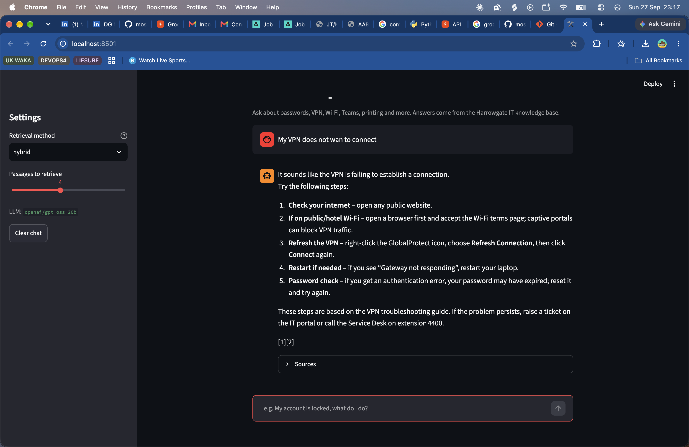
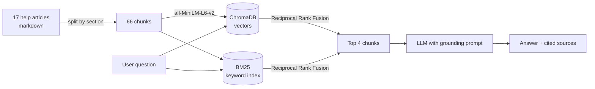

# 🛠️ IT Helpdesk Assistant: a RAG chatbot

An AI assistant that answers employee IT support questions ("my account is locked", "VPN won't connect in my hotel") using a company's own help articles, with cited sources. It uses **Retrieval-Augmented Generation (RAG)**: search the knowledge base first, then have an LLM write an answer grounded only in what was found.

Built from my experience as an IT support engineer, where the same questions come in every day and the answers already exist in documentation that nobody reads.

**Live demo:** _[add your Streamlit Cloud link]_



## Features

- **Hybrid search**: combines BM25 keyword search with semantic embedding search using Reciprocal Rank Fusion
- **Grounded answers with citations**: the LLM may only use retrieved extracts, and cites them as [1], [2]
- **Safe fallback**: off-topic or unanswerable questions are redirected to the Service Desk instead of hallucinated
- **Evaluation suite**: 44 labelled test questions plus 5 off-topic questions measure retrieval and answer quality
- **Model-agnostic**: works with Groq (free), a local model via Ollama, or OpenAI; switch with one setting
- **Works without an API key**: shows the most relevant help articles directly

## How it works



1. **Ingest** (`src/ingest.py`): each article is split into one chunk per section, the article title is prepended so every chunk keeps its context, and chunks are embedded and stored in ChromaDB.
2. **Retrieve** (`src/retriever.py`): the question is searched two ways and the rankings are fused.
3. **Generate** (`src/generator.py`): the top chunks are numbered and passed to the LLM with strict instructions to answer only from them.

## Results

Run `python -m eval.evaluate` to reproduce. _(Replace with your own numbers from `eval/results.md`.)_

| Method | Hit@1 | Hit@3 | MRR |
|---|---|---|---|
| BM25 (keyword) | | | |
| Dense (embeddings) | | | |
| **Hybrid** | | | |

**Hit@3** = % of questions where the correct help section was in the top 3 results. **MRR** rewards ranking it first.

## Quick start

Requires Python 3.10+.

```bash
git clone https://github.com/<your-username>/it-helpdesk-rag.git
cd it-helpdesk-rag
python -m venv .venv
.venv\Scripts\activate          # Windows   (Mac/Linux: source .venv/bin/activate)
pip install -r requirements.txt

copy .env.example .env          # Windows   (Mac/Linux: cp .env.example .env)
# edit .env and paste your free Groq key from https://console.groq.com/keys

python -m src.ingest            # build the search index (downloads a ~90 MB model once)
streamlit run app.py            # opens the chat in your browser
python -m eval.evaluate         # retrieval metrics
python -m eval.evaluate --answers   # also grade LLM answers
```

## Design decisions

**Why chunk by section?** Each section of a help article covers one problem ("VPN will not connect"). Fixed-size chunks would cut steps in half. Sections are also short enough (50–150 words) to embed well.

**Why prepend the title to each chunk?** A section called "If self-service does not work" means nothing on its own. Adding "Resetting Your Password" gives both search methods the context.

**Why hybrid search?** Keyword search is strong on exact terms (*BitLocker*, *GlobalProtect*, *4400*), but misses paraphrases: "my laptop crawls" contains no words from "Slow Laptop Performance". Embeddings capture meaning but can miss rare exact terms. Fusing both covers each method's weaknesses.

**Why Reciprocal Rank Fusion?** BM25 scores are unbounded while cosine similarity is 0–1, so the raw scores can't be added. RRF uses only ranks (`1 / (60 + rank)`), so it needs no tuning.

**How are hallucinations reduced?** Low temperature (0.1), an instruction to use only the numbered extracts, required citations, and an explicit fallback to "raise a ticket" when the answer isn't there. The evaluation measures whether off-topic questions are actually declined.

**Limitations.** Answer accuracy is graded by checking for key facts, which is strict and can miss correct paraphrases, so read the failures the script prints. The knowledge base is small and fictional; a real deployment would need access control, since not every employee should see every document.

## Project structure

```
├── app.py               Streamlit chat interface
├── src/
│   ├── config.py        settings (models, paths), read from .env
│   ├── ingest.py        load → chunk → embed → store
│   ├── retriever.py     BM25, dense and hybrid search
│   └── generator.py     grounding prompt + LLM call
├── eval/
│   ├── questions.jsonl  44 labelled questions + 5 off-topic
│   └── evaluate.py      Hit@k, MRR, answer accuracy, refusal rate
└── data/kb/             17 IT help articles (fictional company)
```

## Deploy for free (Streamlit Community Cloud)

1. Push this repo to GitHub (check that `.env` is **not** included).
2. Go to [share.streamlit.io](https://share.streamlit.io), click **New app**, and choose this repo and `app.py`.
3. Under **Advanced settings → Secrets**, add:
   ```
   LLM_API_KEY = "your-groq-key"
   ```
4. Deploy. The first load builds the index, which takes about a minute.

## Ideas for extending it

- Add a re-ranking step with a cross-encoder model and measure whether Hit@1 improves
- Let users rate answers 👍/👎 and log questions the bot could not answer, to show which help articles are missing
- Swap in your own documents, such as real public IT guides from a university

The knowledge base describes a fictional company, Harrowgate Logistics. All names, numbers and URLs are made up.
